<!-- - - - - - - - - - - - - - - - - - - - - - - - - - - - - - - - - - - - -->
## A4: *git* - Setup

[*Git*](https://git-scm.com) is a widely used
[*source-code management*](https://en.wikipedia.org/wiki/Comparison_of_version-control_software)
tool originally developed by *Linus Torvalds* for the large-scale, distributed
development of the *Linux*-kernel. *Git* was first released in 2005.

*Git* is primarily a *local tool*. Verify you have the *git* installed
and install, if not:

```sh
git --version               --> git version 2.48.1.windows.1
```

[*GitLab*](https://en.wikipedia.org/wiki/GitLab) e.g.
[*https://gitlab.bht-berlin.de*](https://gitlab.bht-berlin.de) or
[*GitHub*](https://en.wikipedia.org/wiki/GitHub) (owned by *Microsoft*)
are *services* that are hosted on the network to share code between
developers by exchanging (*pushing* and *pulling*) commits.


&nbsp;
---
### Complete *.gitconfig* file

*Git* uses a dotfile
[*.gitconfig*](https://github.com/sgra64/dotfiles/blob/main/.gitconfig)
in the user's *HOME* directory stores the user's system-wide *git*-settings
that are valid for all *git* projects a user has on a laptop.
File *.gitconfig* is created when local command *git* is called for the
first time on your laptop.

If you have never created a local *git* repository on your laptop, you are
asked for your name and email-address, which *git* enters in the created
*.gitconfig* file.

Locate the *.gitconfig* in your *HOME*-directory and inspect and add few
more entries (see file
[*$HOME/.gitconfig*](https://github.com/sgra64/dotfiles/blob/main/.gitconfig)).
Understand the meaning of those lines:

```sh
# add entries 'user.name' and 'user.email' to file '.gitconfig'
git config --global user.name "your name"
git config --global user.email "your@email.com"

# add more entries:
git config --global core.ignorecase true        # ignore upper/lower case in file names
git config --global core.autocrlf false         # disable crlf conversion on checkout
git config --global core.filemode false         # ignore filemode (rwx) changes
git config --global core.eol lf                 # always use newline '\n' as end-of-line

git config --global init.defaultBranch main     # 'main' is default branch, not 'master'
```

Show the content of file *$HOME/.gitconfig*:

```sh
cat $HOME/.gitconfig        # show '.gitconfig' file
```
```
[user]
    name = Sven Graupner                <-- your name
    email = sgraupner@bht-berlin.de     <-- your email address

[core]
    ignorecase = true       # ignore upper/lower case in file names
    autocrlf = false        # disable crlf conversion on checkout
    filemode = false        # ignore filemode (rwx) changes
    eol = lf                # always use newline '\n' as end-of-line

[init]
        defaultBranch = main
```


&nbsp;
---
### Create a new project

Create a new project `hello-world` at a path you use for projects, e.g. under
path: `~/workspaces` and put the project under git control:

```sh
cd workspaces                       # cd to directory with projects
mkdir hello-world                   # create new project directory 'hello-world'
cd hello-world                      # cd into the new project

ls -la                              # make sure you are in the project directory
```
```
total 6
drwxr-xr-x 1   0 Apr  6 22:15 ./
drwxr-xr-x 1   0 Apr  6 22:14 ../
```

Create a file `HelloWorld.java` that prints the line *"Hello, World!"*:

```java
public class HelloWorld {

    public static void main(String[] args) {
        System.out.println("Hello, World!");
    }
}
```

or the equivalent for Python: `hello-world.py`:

```python
def hello_world():
    print("Hello World")

hello_world()
```

Compile the java-file and execute (or run the python file) such that
line *"Hello World!"* is printed:

```
Hello World!
```

Show files in the project directory (in the following, the java-files are shown):

```sh
ls -la                              # make sure you are in the project directory
```
```
total 6
drwxr-xr-x 1   0 Apr  6 22:15 ./
drwxr-xr-x 1   0 Apr  6 22:14 ../
-rw-r--r-- 1 427 Apr  6 22:15 HelloWorld.class
-rw-r--r-- 1 123 Apr  6 21:40 HelloWorld.java
```


&nbsp;
---
### Put the project under *git* control

Initialize the project as a *git* project. This must be done in the project directory:

```sh
# create new local git repository
git init --initial-branch=main      # initialize new local git repository
```

Git has created a new local git repository of the project that resides in a
sub-directory of the project named `.git` (mind the dot `.`):

```sh
ls -la                              # show the content of the project directory
```

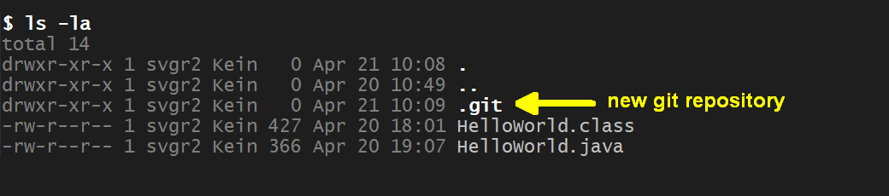
<!-- 
```
total 14
drwxr-xr-x 1   0 Apr  6 22:17 ./
drwxr-xr-x 1   0 Apr  6 22:14 ../
drwxr-xr-x 1   0 Apr  6 22:17 .git/             <-- new directory with git repository
-rw-r--r-- 1 427 Apr  6 22:15 HelloWorld.class
-rw-r--r-- 1 123 Apr  6 21:40 HelloWorld.java
```
-->


Next, create a first, empty root commit and tag the commit as *"root"*:

```sh
git commit --allow-empty -m "root commit (empty)"       # create empty commit
git tag root                                            # tag commit as 'root'
```

Show the first commit:

```sh
# show the commit (full)
git log
```
<!-- 
```
commit fe36082634fbf491f0347664aa40c80b8f49a3ff (tag: root)
Author: Sven Graupner <sgraupner@bht-berlin.de>
Date:   Mon Apr 20 18:27:36 2026 +0200

    root commit (empty)
```
-->

The *commit-ID* are shown as 40-Byte hashes that are computed from the
content of the committed files (*fe36082634fbf491f0347664aa40c80b8f49a3ff*).
The commit also contains the committer's name (*Author*), the timestamp
when the commit was made and the commit message (*"root commit (empty)"*):

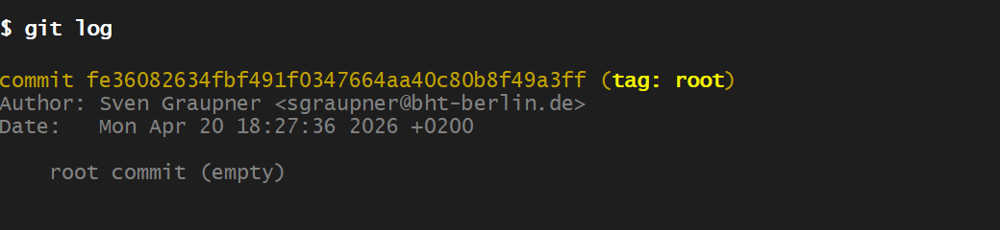


The short form of the command only shows the first 7-digits of the
*commit-ID* (*fe36082*) with the commit message:

```sh
# show the commit (short version)
git log --oneline
```

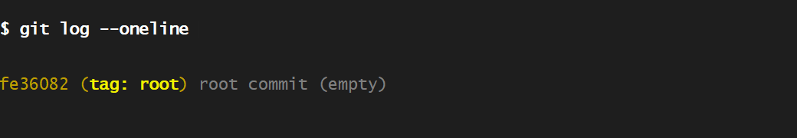
<!-- 
```
fe36082 (HEAD -> main, tag: root) root commit (empty)   <-- empty root commit
```
-->


Show the *git status* of the project:

```sh
git status
```

Output shows two files as *"untracked files"* (unknown the git):

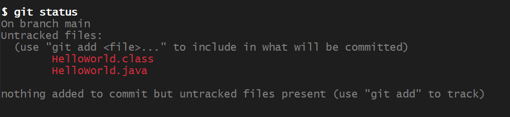

*Source code* (file `HelloWorld.java`) will be checked into the git repository
(*"committed"*), while *compiled code* (file `HelloWorld.class`) will not be
committed to the *git* repository.

&nbsp;

Learn about special file
[*.gitignore*](https://www.w3schools.com/git/git_ignore.asp).
The next step is to create a `.gitignore` file that tells *git* to ignore files
ending with `.class` from being committed or listed as *untracked files*.

Create a new file `.gitignore` (mind the dot `.` in front of the name) with content:

```sh
# make git to ignore files ending with '.class' (compiled classes)
*.class
```

Show the content of the new file.

```sh
cat .gitignore          # show content of the new '.gitignore' file

git status              # show the project status
```

The project's *git status* no longer shows file `HelloWorld.class` as *untracked*,
but the new file `.gitignore` appears:

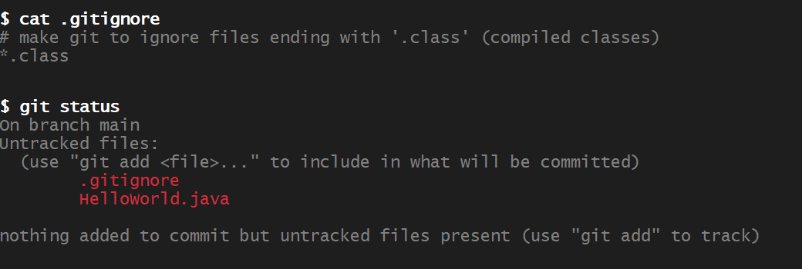
<!-- 
```
On branch main
Untracked files:
  (use "git add <file>..." to include in what will be committed)
        .gitignore
        HelloWorld.java
```
nothing added to commit but untracked files present (use "git add" to track)
-->


&nbsp;

Next, stage file `.gitignore` (*stage:* include file for the coming *commit*).

A *"git commit"* is a *set (snapshot) of files* that is recorded on a line
of commits (called a *branch*). The branch is called *main*.
A commit is always added at the end of a branch after a preceeding commit.
A *branch* hence is a sequence (or a line) of recorded commits.

Commits are created in two steps in *git*:

1. *"staging"* - a step that defines the set of files to be committed.
    During *staging*, files can be added or removed to/from the so-called
    *staging area* in the local repository that is defining the files for
    the upcomming commit. No commit is created during *staging* nor other
    harm can be done.

2. *"commit"* - all files from the *staging area* are bundled as a snapshot,
    assigned a unique *commit-ID* and appended at the end of the current branch.
    The *staging area* is cleared.

*"Staging"* is performed by the `git add <files>` command adding files to the
*"staging area"* (command `git reset <files>` removes files from the
*staging area*):

```sh
# stage file '.gitignore'
git add .gitignore

git status
```

Output shows the file `.gitignore` staged (in *green*):

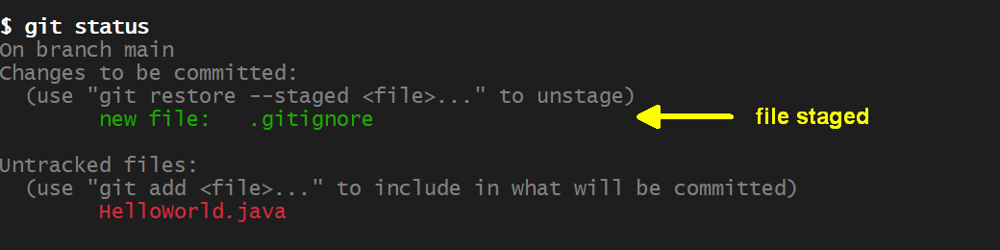
<!-- 
```
On branch main
Changes to be committed:
  (use "git restore --staged <file>..." to unstage)
        new file:   .gitignore
Untracked files:
  (use "git add <file>..." to include in what will be committed)
        HelloWorld.java
```
-->

Next, commit the staged content with message: *"add .gitignore"* and show the new commit:

```sh
# commit staged content
git commit -m "add .gitignore"

# show the new commit
git log --oneline
```

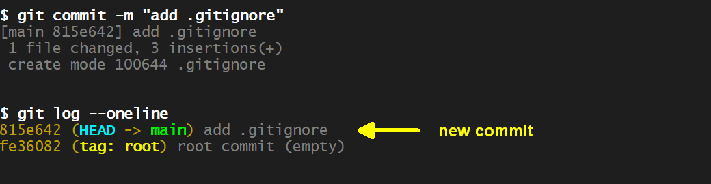
<!-- 
```
815e642 (HEAD -> main) add .gitignore
fe36082 (tag: root) root commit (empty)
```
-->

Next, commit and stage the source file `HelloWorld.java`:

```sh
# stage file 'HelloWorld.java'
git add HelloWorld.java

# commit staged file 'HelloWorld.java'
git commit -m "add HelloWorld.java"

# show the new commit
git log --oneline
```

The commit-log now shows three commmits:

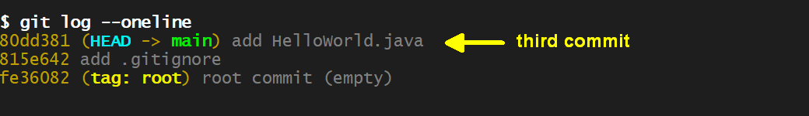
<!-- 
```
0de1d03 (HEAD -> main) add HelloWorld.java
815e642 add .gitignore
fe36082 (tag: root) root commit (empty)
```
-->

*HEAD* points to the last commit  of the *main* branch indicating the
commit the project directory (*"working tree"*) is synchronized with.

After commmits, the *"working tree is clean"*, which means there are no
uncommitted changes:

```sh
# show git status of the project
git status
```
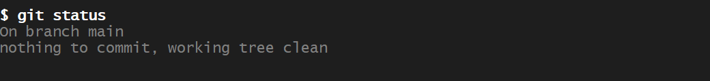
<!-- 
```
On branch main
nothing to commit, working tree clean
```
-->


Next, add [*Javadoc*](https://en.wikipedia.org/wiki/Javadoc) to file `HelloWorld.java`
(or the equivalent [*docstring*](https://realpython.com/documenting-python-code/)
to file `hello-world.py`, see [*instructions*](pydoc-instructions.txt)):

```java
/**
 * Class with static {@code main(String[] args)} function that
 * prints the {@code "Hello, World!"} message.
 */
public class HelloWorld {

    /**
     * Print the {@code "Hello, World!"} message.
     * @param args arguments passed from the command line
     */
    public static void main(String[] args) {
        System.out.println("Hello, World (with Javadoc)!");
    }
}
```

The *git* status of the project shows the change (called *"dirty state"*):

```sh
# show git status of the project
git status
```
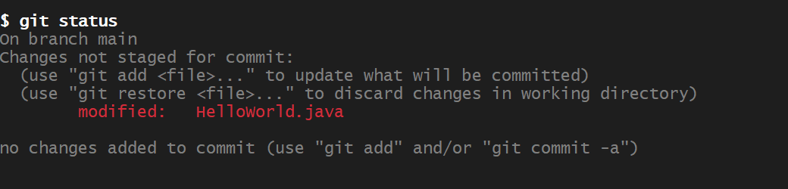
<!-- 
```
On branch main
Changes not staged for commit:
  (use "git add <file>..." to update what will be committed)
  (use "git restore <file>..." to discard changes in working directory)
        modified:   HelloWorld.java
no changes added to commit (use "git add" and/or "git commit -a")
```
-->


One can inspect changes with the *git diff* command. Green lines show new
or updated lines while red lines show prior lines that have been deleted:

```sh
# show the modifications made to file 'HelloWorld.java'
git diff HelloWorld.java
```
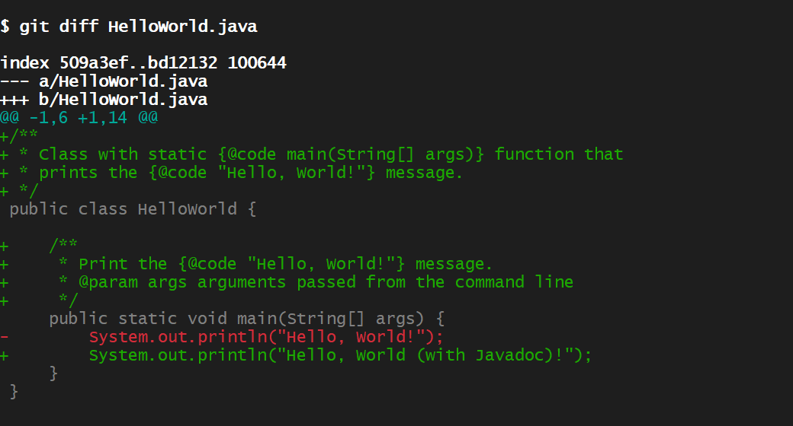
<!-- 
```
diff --git a/HelloWorld.java b/HelloWorld.java
index 509a3ef..bd12132 100644
--- a/HelloWorld.java
+++ b/HelloWorld.java
@@ -1,6 +1,14 @@
+/**
+ * Class with static {@code main(String[] args)} function that
+ * prints the {@code "Hello, World!"} message.
+ */
 public class HelloWorld {
+    /**
+     * Print the {@code "Hello, World!"} message.
+     * @param args arguments passed from the command line
+     */
     public static void main(String[] args) {
-        System.out.println("Hello, World!");
+        System.out.println("Hello, World (with Javadoc)!");
     }
 }
```
-->


Stage the changes (but don't commit yet):

```sh
# stage modifications made to file 'HelloWorld.java'
git add HelloWorld.java

# show git status of the project
git status
```
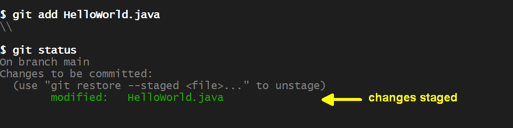
<!-- 
```
diff --git a/HelloWorld.java b/HelloWorld.java
index 509a3ef..bd12132 100644
--- a/HelloWorld.java
+++ b/HelloWorld.java
@@ -1,6 +1,14 @@
+/**
+ * Class with static {@code main(String[] args)} function that
+ * prints the {@code "Hello, World!"} message.
+ */
 public class HelloWorld {
+    /**
+     * Print the {@code "Hello, World!"} message.
+     * @param args arguments passed from the command line
+     */
     public static void main(String[] args) {
-        System.out.println("Hello, World!");
+        System.out.println("Hello, World (with Javadoc)!");
     }
 }
```
-->

In case of the *Java*-project, create the *HTML* from the doc-Strings
using the `javadoc` compiler (or see [*instructions*](pydoc-instructions.txt)
for *Python*):

```sh
# generate java documentation, output (-d) is in directory 'doc'
javadoc -Xdoclint:-missing -d doc HelloWorld.java
```
```
Loading source file HelloWorld.java...
Constructing Javadoc information...
Building index for all the packages and classes...
Standard Doclet version 21+35-LTS-2513
Building tree for all the packages and classes...
Generating javadoc\HelloWorld.html...
Generating javadoc\package-summary.html...
Generating javadoc\package-tree.html...
Generating javadoc\overview-tree.html...
Building index for all classes...
Generating javadoc\allclasses-index.html...
Generating javadoc\allpackages-index.html...
Generating javadoc\index-all.html...
Generating javadoc\search.html...
Generating javadoc\index.html...
Generating javadoc\help-doc.html...
```

Show the new directory `doc` in the project directory:

```sh
ls -la                                  # show content of the project directory
```
```
total 23
drwxr-xr-x 1 svgr2 Kein   0 Apr 25 23:24 .
drwxr-xr-x 1 svgr2 Kein   0 Apr 23 13:22 ..
drwxr-xr-x 1 svgr2 Kein   0 Apr 25 23:21 .git
-rw-r--r-- 1 svgr2 Kein  76 Apr 21 10:33 .gitignore
-rw-r--r-- 1 svgr2 Kein 427 Apr 20 18:01 HelloWorld.class
-rw-r--r-- 1 svgr2 Kein 382 Apr 25 23:14 HelloWorld.java
drwxr-xr-x 1 svgr2 Kein   0 Apr 25 23:24 doc            <-- new directory containing HTML
```

Open file `doc/index.html` in a browser to see the documentation:

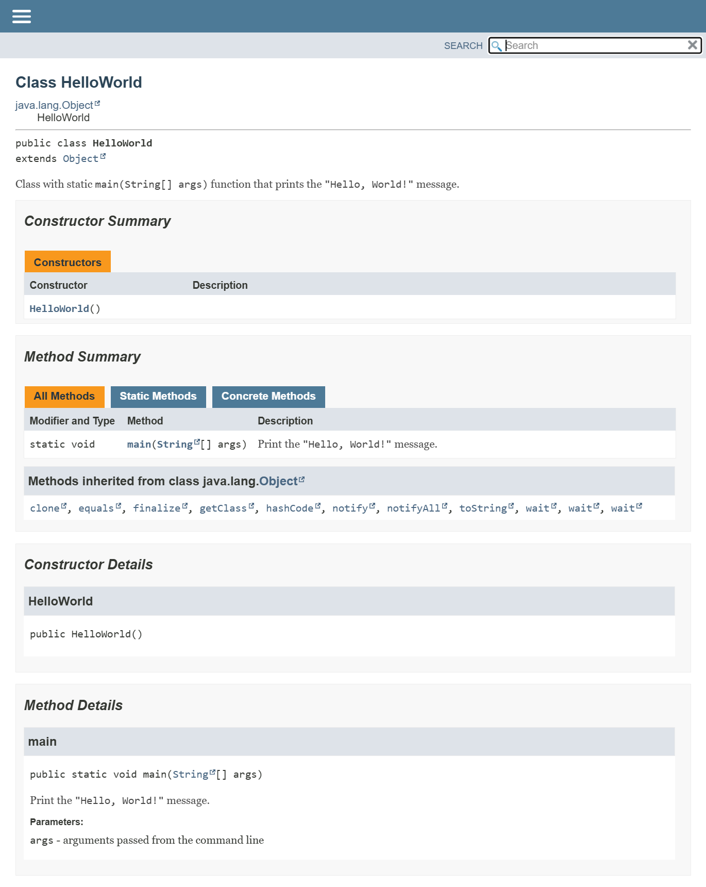

&nbsp;

Checking the status of the project, we find the previously staged changes
in file `HelloWorld.java` and the new directory `doc` as *"untracked files"*:

```sh
git status                              # show status of the project directory
```
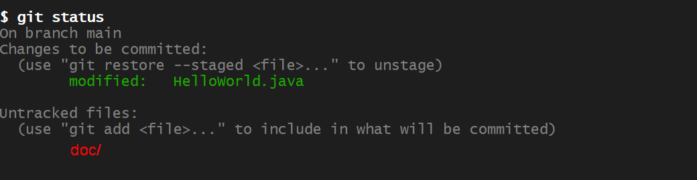
<!-- 
On branch main
Changes to be committed:
  (use "git restore --staged <file>..." to unstage)
        modified:   HelloWorld.java
Untracked files:
  (use "git add <file>..." to include in what will be committed)
        doc/
-->

Directory `doc` contains generated content that hence should not be
recorded. Consequently, add the directory to file `.gitignore`.

```sh
# add 'doc' to file '.gitignore'

# after that, show the content of file '.gitignore'
cat .gitignore
```
```
# make git to ignore files ending with '.class' (compiled classes)
*.class
doc/                                    <-- new line added
```

The *git* status of the project has changed: directory `doc` is now being
ignored, but changes in file `.gitignore` are shown as modification:

```sh
git status                              # show status of the project directory
```
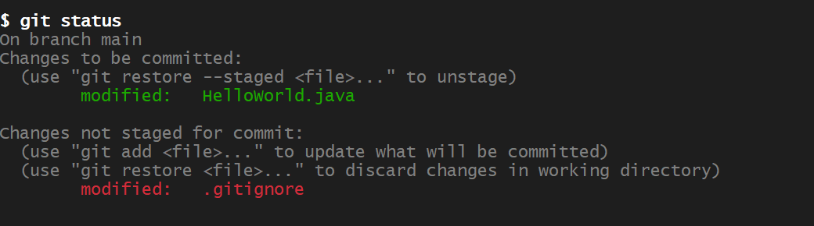
<!-- 
On branch main
Changes to be committed:
  (use "git restore --staged <file>..." to unstage)
        modified:   HelloWorld.java
Changes not staged for commit:
  (use "git add <file>..." to update what will be committed)
  (use "git restore <file>..." to discard changes in working directory)
        modified:   .gitignore
-->

Stage the change to file `.gitignore` and show the *git* status:

```sh
git add .gitignore                      # stage changes in file '.gitignore'

git status                              # show status of the project directory
```
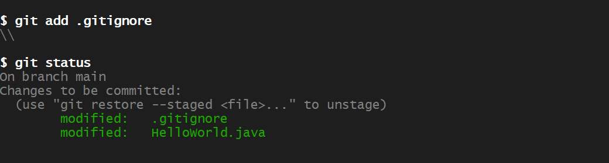
<!-- 
On branch main
Changes to be committed:
  (use "git restore --staged <file>..." to unstage)
        modified:   .gitignore
        modified:   HelloWorld.java
-->

Both staged changes are related to the added *Javadoc* and can be committed
with message: *"add Javadoc"*:

```sh
git commit -m "add Javadoc"             # commit staged changes
```
```
[main 5fd5c21] add Javadoc
 2 files changed, 10 insertions(+), 2 deletions(-)
```

After the commit, the *git* status is clean and the *git* log shows the
new commit:

```sh
git status                              # show status of the project directory

git log --oneline
```
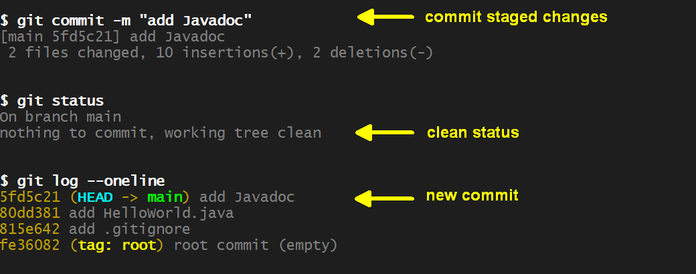
<!-- 
On branch main
Changes to be committed:
  (use "git restore --staged <file>..." to unstage)
        modified:   HelloWorld.java
Changes not staged for commit:
  (use "git add <file>..." to update what will be committed)
  (use "git restore <file>..." to discard changes in working directory)
        modified:   .gitignore
-->


The next command shows the difference between the current (last) commit
addressed by `HEAD` and the previous commit addressed by `HEAD~1`
(read: *HEAD* minus 1, the tilde sign `'~'` is used for the minus sign
since `'-'` has other effects in shell commands):

```sh
# show the differences recorded in the last commit
git diff HEAD~1..HEAD --name-status
```
```
M       .gitignore              <-- 'M' means file '.gitignore' has modifications
M       HelloWorld.java         <-- 'M' means file 'HelloWorld.java' has modifications
```

One can also inspect changes recorded in individual files between commits.
The next command shows the line (green) added to file `.gitignore`:

```sh
# show the difference in file '.gitignore'
git diff HEAD~1..HEAD -- .gitignore
```
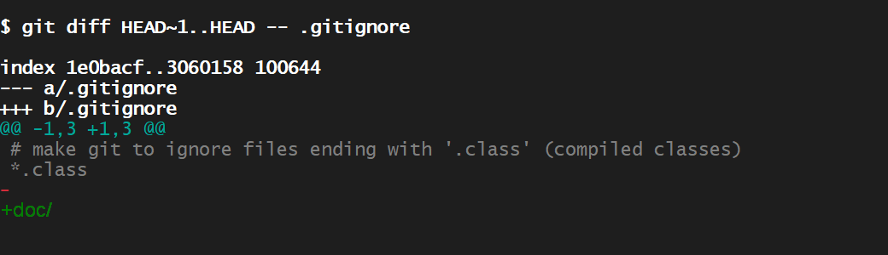
<!-- 
diff --git a/.gitignore b/.gitignore
index 1e0bacf..3060158 100644
--- a/.gitignore
+++ b/.gitignore
@@ -1,3 +1,3 @@
 # make git to ignore files ending with '.class' (compiled classes)
 *.class
-
+javadoc/
-->


&nbsp;
---
### Validation

In order to collect points, show a terminal on your laptop with the actities
above and answered questions (on paper or as notes in a text-file).

Commands:

```sh
# show .gitconfig file
cat ~/.gitconfig

# show status of the project is clean
git status

# show the git commit log
git log --one-line
```


Answer question:

1. Where is a local *.git* repository stored?

1. What is a *commit*?

1. What is a *branch*?

1. Why was file `HelloWorld.java` commited, file `HelloWorld.class` and directory `doc` not?

1. What do people mean when they say the project directory is in a *"clean state"* ?

1. When is a *project state* *"dirty"* ?

1. How can *"dirty state"* be cleaned up?

1. Can commits be altered after they have been committed (e.g. files added or removed)?

1. Can commits be altered after they have been pushed to a remote repository?

1. How can mistakenly pushed commits be corrected?
