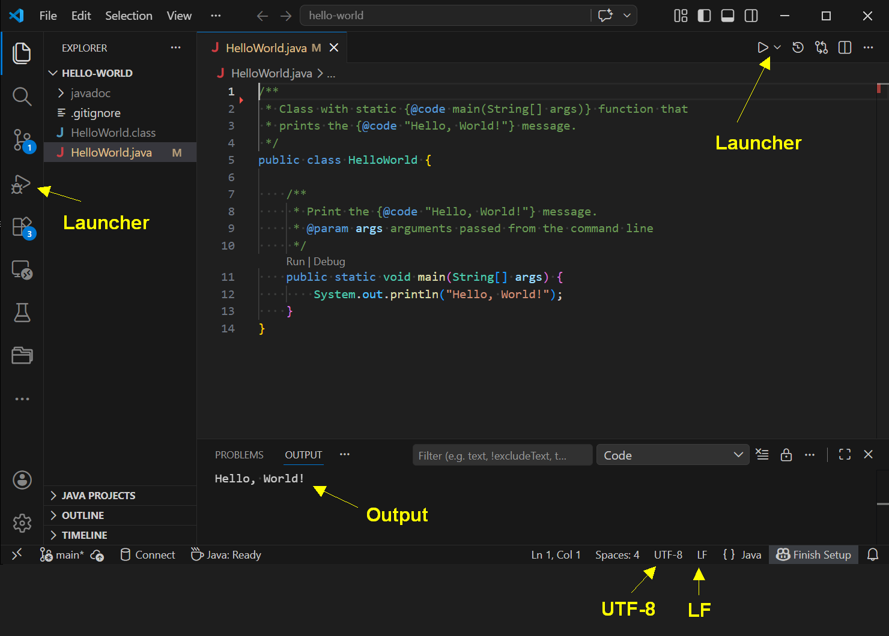

<!-- - - - - - - - - - - - - - - - - - - - - - - - - - - - - - - - - - - - -->
## A5: *VSCode* - Setup

[*Visual Studio Code (VSCode)*](https://code.visualstudio.com) by *Microsoft*
is a modern, popular *IDE* (Integrated Development Environment) with:

- support for multiple programming languages (*"polyglot"*).

- a large ecosystem of extensions (e.g. *"Java extension pack"*, *"Code Runner"*,
    *Docker*, various AI extensions, etc.).

- ability to develop in remote environments (cloud, containers) over the network.

- built-in *AI integration* (Microsoft's *Co-Pilot*) or through extensions,
    e.g. *Claude* and others.


For this course, the following *VSCode* extensions are recommended:

- [*Extension Pack for Java*](https://marketplace.visualstudio.com/items?itemName=vscjava.vscode-java-pack)
    -- required for *Java* courses.

- [*Code Runner*](https://marketplace.visualstudio.com/items?itemName=formulahendry.code-runner)
    -- recommended.


&nbsp;
---
### Setup

*VSCode* opens each project separately (not multiple projects or entire
workspaces at once, which is in contrast to older *IDE* such as *eclipse*).

It is thus recommended to start *VSCode* from within the project directory
in a terminal. Verify that you can start *VSCode* from the terminal, e.g.
by setting *PATH* in `.bashrc`.

Navigate to the project directory and start *VSCode*:

```sh
cd ~/workspaces/hello-world     # cd to into the project directory

code .                          # start VSCode in this '.' (dot) current directory
```

*VSCode* will open the project and show the project files.

Run the *HelloWorld* Program with:

- the internal *launcher* (see screenshot) or with

- [*Code Runner*](https://marketplace.visualstudio.com/items?itemName=formulahendry.code-runner)
    that runs code faster by the key command: `<Ctrl> + <Alt> + N`.

Output of the program should appear in the integrated Terminal panel (launcher) or
in the Output panel (Code Runner).

&nbsp;




&nbsp;
---
### VSCode Paths

*VSCode* installs (by default) under the folloing paths:

```
Windows:    %APPDATA%/Local/Programs/Microsoft\ VS\ Code/bin
MacOS:      /Applications/Visual\ Studio\ Code.app/Contents/Resources/app/bin
```

*VSCode* internally chaches (makes copies of) projects where it compiles
code and writes logs. These *"project caches"* keep all state of a *VSCode*
project and are supposed to be hidden and separate from the actual project.
This allows to keep project spaces clean and not cluttered with interim files.

While this is good, sometimes it happens that strange effects happen in
a *VSCode* project. Then, the project cache should be cleaned and reset.

Project cache reset occurs in two steps:

1. *regular reset* -- by `<Ctrl> + <Shift> + P` and (for Java) searching
    for *"Java: Clean Java Language Server Workspace"* and performing
    this action. *VSCode* will rebuild the project cache.

2. *hard reset* -- if this does not help, the project cache can be removed
    in the file system.

    Paths of project caches are:

    ```
    Windows:    %APPDATA%/Code/User/workspaceStorage
    - example:  C:/Users/<user>/AppData/Roaming/Code/User/workspaceStorage

    Mac:        $HOME/Library/Application\ Support/Code/User/workspaceStorage
    ```

    Remove the (or all) directories with project caches and restart *VSCode*.
    *VSCode* will rebuild a new project cache.


&nbsp;
---
### VSCode Settings

*VSCode* maintains its settings in `settings.json` files. One (system-wide)
settings file has settings valid for all projects on the system.
A project can also hold specific project settings in the project directory
under `.vscode/settings.json`.

Locate the system-wide *VSCode* settings file on your system:

```sh
# VSCode global settings file and project caches:
- Windows:  %APPDATA%/Code/User
            e.g.: C:/Users/<user>/AppData/Roaming/Code/User

- MacOS:   ~/Library/Application\ Support/Code/User

- Linux:   $HOME/.config/Code/User/settings.json
       +
       +-- settings.json         ; VSCode global settings file
       +-- workspaceStorage      ; VSCode project caches
```

Locate your system-wide *VSCode* settings file and add usefull settings,
particularly for turning-on *auto-save* and using *UTF-8*. Review also
other settings and choose those that are suitable for you.

```json
{
    // General settings
    "explorer.confirmDelete": false,        // ask to comfirm file delete
    "files.autoSave": "afterDelay",         // 'afterDelay' (1sec), 'onFocusChange', 'onWindowChange'
    "files.autoSaveDelay": 800,
    "files.eol": "\n",                      // use '\n' as default line ending
    "files.associations": {                 // chose syntax highlighting by file endings
        "*.rc": "shellscript",
        "*.path": "shellscript",
        "**/.termrc": "shellscript"
    },
    "terminal.integrated.hideOnStartup": "always",  // prevent terminal showing-up on startup
    "explorer.confirmDelete": false,        // ask to comfirm file delete
    "files.autoSave": "afterDelay",         // 'afterDelay' (1sec), 'onFocusChange', 'onWindowChange'
    "files.autoSaveDelay": 800,
    "files.eol": "\n",                      // use '\n' as default line ending (not: CR/LF)
    "redhat.telemetry.enabled": false,
    "testing.resultsView.layout": "treeLeft",
    // "security.workspace.trust.untrustedFiles": "open",

    // Appearance and assistance settings
    "workbench.colorTheme": "Dark Modern",
    "chat.viewSessions.orientation": "stacked",
    "github.copilot.nextEditSuggestions.enabled": false,
    "github.copilot.enable": {
        "*": false,
        "plaintext": false,
        "markdown": false,
        "scminput": false,
        "java": false
    },
    "geminicodeassist.inlineSuggestions.enableAuto": true,
    // "window.zoomLevel": 1,

    // Editor settings
    "editor.detectIndentation": false,
    "editor.tabSize": 4,
    "editor.insertSpaces": true,            // insert spaces for tabs
    "editor.renderWhitespace": "all",       // show white spaces in editor as small dots
    "editor.hover.enabled": "on",           // show context when hovering
    "editor.hover.delay": 1500,             // delay hover-time for context pop-ups (in ms)
    "editor.minimap.enabled": false,        // show minimap for long files
    "editor.inlayHints.enabled": "off",     // don't show argument names in method calls

    // Terminal settings, see https://code.visualstudio.com/docs/terminal/profiles
    "terminal.integrated.defaultProfile.windows": "Bash",
    "terminal.integrated.profiles.windows": {
        "Bash": {
          "path": ["bash"],
          //"args": ["--init-file", "'${workspaceFolder}'/.vscode/launch_terminal.sh"],
          "args": ["--init-file", "~/.profile"],
          "icon": "terminal-bash",
        },
        "cmd.exe": {
           "path": ["cmd.exe"],             // add 'cmd.exe' terminal
        },
        "PowerShell": null,                 // remove other terminals from menu unless
        "Git Bash": null,                   // you want them
        "Command Prompt": null,
        "JavaScript Debug Terminal": null,
        "Ubuntu (WSL)": null,
    },

    // Docker settings (extension)
    "docker.commands.attach": "${containerCommand} exec -it ${containerId} ${shellCommand}",
    "containers.commands.attach": "${containerCommand} exec -it ${containerId} ${shellCommand}",

    // Git settings
    "git.confirmSync": false,
    "git.openRepositoryInParentFolders": "never"
}
```

Project-specific settings overrule system-wide settings and are included in
the project directory under: `.vscode/settings.json`.
Example of settings for a *Java* project:

```json
{
    // Project Code Runner (extension) settings
    "code-runner.defaultLanguage": "java",
    "code-runner.showExecutionMessage": false,
    "code-runner.clearPreviousOutput": true,
    "code-runner.executorMap": {
        "python": "c:/Users/svgr2/AppData/Local/Programs/Python/Python312/python.exe",
        "java": "java $fileNameWithoutExt",
        // "c": "cd $dir && gcc $fileName -o $fileNameWithoutExt && $dir$fileNameWithoutExt",
        // "cpp": "cd $dir && g++ -std=c++14 $fileName -o $fileNameWithoutExt && $dir$fileNameWithoutExt",
        // "html": "\"C:\\Program Files (x86)\\Google\\Chrome\\Application\\chrome.exe\""
    },

    // Project Java settings
    "java.configuration.updateBuildConfiguration": "automatic",
    "java.debug.settings.onBuildFailureProceed": true,
    "java.debug.settings.showHex": true,
    // set 'java.home'
    // "java.jdt.ls.java.home": "C:/Program Files/Java/jdk-21",
    // "java.configuration.runtimes": [{
    //     "name": "JavaSE-21",
    //     // (mac) "path": "/Library/Java/JavaVirtualMachines/adoptopenjdk-11.jdk/Contents/Home",
    //     // (mac) "path": "/opt/homebrew/opt/openjdk@11/libexec/openjdk.jdk/Contents/Home",
    //     // (Linux) "path": "/usr/lib/jvm/java-21-openjdk-amd64",
    //     "path": "C:/Program Files/Java/jdk-21",
    //     "javadoc": "https://docs.oracle.com/en/java/javase/21/docs/api",
    //     "default": true
    // }],
    // "java.inlayHints.parameterNames.enabled": "none",
    // "java.debug.settings.onBuildFailureProceed": true,
    // // disable warnings for unused imports in Java in Visual Studio Code
    // "java.compile.nullAnalysis.mode": "disabled",

    // Project Maven settings
    "maven.executable.path": "C:/opt/maven/bin",
    "maven.settingsFile": "",
}
```

See also [*dev-container-java/.vscode*](dev-container-java/.vscode) for the
settings of the Java devcontainer project.


&nbsp;
---
### Advanced Editing

[*Multi-cursor*](https://code.visualstudio.com/docs/editing/codebasics)
editing is an advanced method to quickly perform edits at multiple
locations at the same time.

Set multiple cursors by:

```
<Ctrl> + <Alt> + <Cursor-Up/-Down>

<Alt> + <Click>
```

Block-comment multiple lines by:

```
mark text and Ctrl-'#'
```


&nbsp;
---
### Detach the integrated terminal using Key-bindings

*Detaching a terminal* disconnects the terminal from the main *VSCode* panel
into a separat window.

*Key-bindings* are sequences of key strokes that can be defined to quickly
perform actions. Custom key-bindings are stored in a file: `keybindings.json`
that is stored with the system-wide or project `settings.json` file.

The following `keybindings.json` file holds the bindings for actions:

- *detach terminal* (`workbench.action.terminal.moveIntoNewWindow`)
    by: `<Ctrl> + <t> + <Ctrl> + <d>`,

- *attach terminal* (`workbench.action.terminal.moveToTerminalPanel`)
    by: `<Ctrl> + <t> + <Ctrl> + <a>`.

Set these key-bindings in *VSCode*:

```
^K + ^S -- open keybindings and search for: "Terminal: Move"

add key-bindings:
- ^T + ^D - detach terminal
- ^T + ^E - re-attach terminal to editor area
- ^T + ^P - re-attach terminal into panel
```

Verify settings in the system-wide `settings.json` file:

```json
// Place your key bindings in this file to override the defaults
// - https://code.visualstudio.com/docs/getstarted/keybindings
[
    {
        "key": "ctrl+t ctrl+d",
        "command": "workbench.action.terminal.moveIntoNewWindow"
    },
    {
        "key": "ctrl+t ctrl+a",
        "command": "workbench.action.terminal.moveToTerminalPanel"
    }
]
```


&nbsp;
---
### Validation

In order to collect points, show *VSCode* working on your laptop with
the settings turned-on in the figure:

- `UTF-8`.

- LF (not `CR/LF`).

- *"Hello, World!"* printout after running the program with *Code Runner*.

- open detached terminal with key-bindings and run *"Hello, World!"* there.

